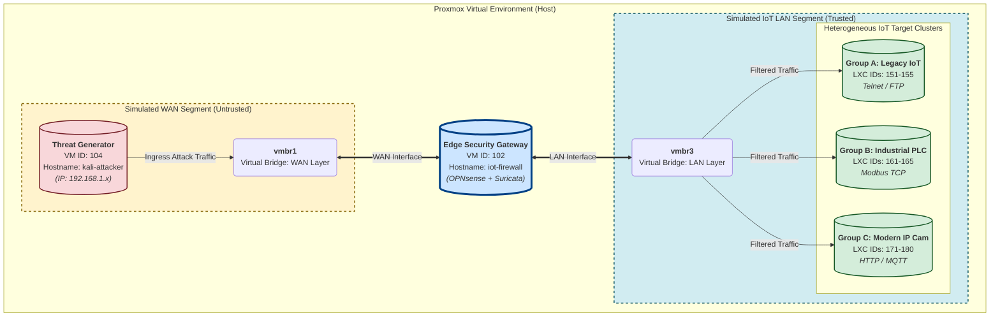

```mermaid

graph TD
    %% 定義樣式
    classDef attacker fill:#f8d7da,stroke:#721c24,stroke-width:2px;
    classDef firewall fill:#cce5ff,stroke:#004085,stroke-width:4px;
    classDef victim fill:#d4edda,stroke:#155724,stroke-width:2px;
    classDef net fill:#e2e3e5,stroke:#383d41,stroke-width:1px,stroke-dasharray: 5 5;

    %% 修正點：加上雙引號
    subgraph PVE ["Proxmox Virtual Environment (Host)"]
        
        %% 1. 外部網路段
        %% 修正點：加上雙引號
        subgraph WAN_Segment ["Simulated WAN Segment (Untrusted)"]
            style WAN_Segment fill:#fff3cd,stroke:#856404,stroke-width:2px,stroke-dasharray: 5 5
            VMBR1(<b>vmbr1</b><br>Virtual Bridge: WAN Layer)
            
            Kali[("<b>Threat Generator</b><br>VM ID: 104<br>Hostname: kali-attacker<br><i>(IP: 192.168.1.x)</i>")]:::attacker
        end

        %% 2. 核心閘道
        OPNsense[("<b>Edge Security Gateway</b><br>VM ID: 102<br>Hostname: iot-firewall<br><i>(OPNsense + Suricata)</i>")]:::firewall

        %% 3. 內部網路段
        %% 修正點：加上雙引號
        subgraph LAN_Segment ["Simulated IoT LAN Segment (Trusted)"]
            style LAN_Segment fill:#d1ecf1,stroke:#0c5460,stroke-width:2px,stroke-dasharray: 5 5
            VMBR3(<b>vmbr3</b><br>Virtual Bridge: LAN Layer)

            %% 修正點：加上雙引號
            subgraph IoT_Cluster ["Heterogeneous IoT Target Clusters"]
                direction TB
                Group_A[("<b>Group A: Legacy IoT</b><br>LXC IDs: 151-155<br><i>Telnet / FTP</i>")]:::victim
                Group_B[("<b>Group B: Industrial PLC</b><br>LXC IDs: 161-165<br><i>Modbus TCP</i>")]:::victim
                Group_C[("<b>Group C: Modern IP Cam</b><br>LXC IDs: 171-180<br><i>HTTP / MQTT</i>")]:::victim
            end
        end

        %% 連線關係
        Kali -- "Ingress Attack Traffic" --> VMBR1
        VMBR1 <==>|WAN Interface| OPNsense
        OPNsense <==>|LAN Interface| VMBR3
        VMBR3 -- "Filtered Traffic" --> Group_A
        VMBR3 -- "Filtered Traffic" --> Group_B
        VMBR3 -- "Filtered Traffic" --> Group_C
    end

```
